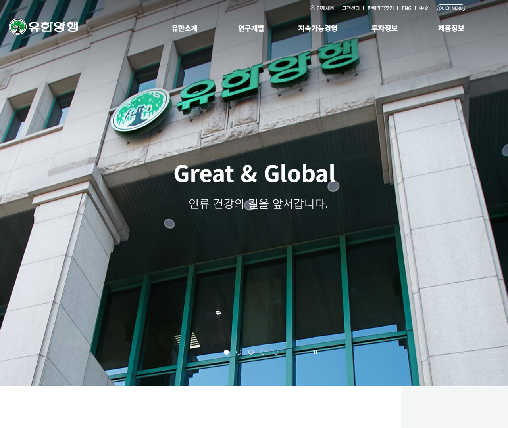
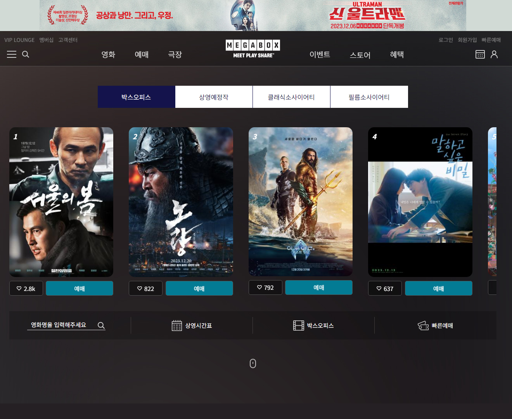

# 신준혁의 포트폴리오    
## [포트폴리오 바로가기](https://dunadan613.github.io/)    
## 담겨진 작업물들   
1. 인천시청    
       
    - 인천시청 홈페이지를 클론코딩으로 재현했습니다.     
    - 작업물 상세    
        - 개인작업 100%      
        - 반응형 : ○     
        - 사용된 플러그인 : swiper.js    
    - [작업물 바로가기](https://dunadan613.github.io/incheon/)   
    - [github 페이지 바로가기](https://github.com/dunadan613/incheon)    
1. 유한양행    
        
    - 유한양행 홈페이지를 클론코딩으로 재현했습니다.    
    - 작업물 상세    
        - 개인작업 100%    
        - 반응형 : Χ(화면너비 1260px 이상에 최적화)    
        - 사용된 플러그인 : jquery, slick, aos    
    - [작업물 바로가기](https://dunadan613.github.io/yuhan/)    
    - [github 페이지 바로가기](https://github.com/dunadan613/yuhan)    
1. 메가박스    
        
    - 메가박스 홈페이지를 반응형으로 리뉴얼했습니다.    
    - 작업물 상세    
        - 직업훈련 실습작품    
        - 반응형 : ○    
        - 사용된 플러그인 : jquery, swiper.js    
    - [작업물 바로가기](https://dunadan613.github.io/megabox/)    
    - [github 페이지 바로가기](https://github.com/dunadan613/megabox)    
1. 메가커피    
        
    - 메가커피 홈페이지를 클론코딩으로 재현했습니다.    
    - 작업물 상세    
        - 직업훈련 실습작품    
        - 반응형 : ○    
        - 사용된 플러그인 : swiper.js    
    - [작업물 바로가기](https://dunadan613.github.io/megacoffee/)    
    - [github 페이지 바로가기](https://github.com/dunadan613/megacoffee)    